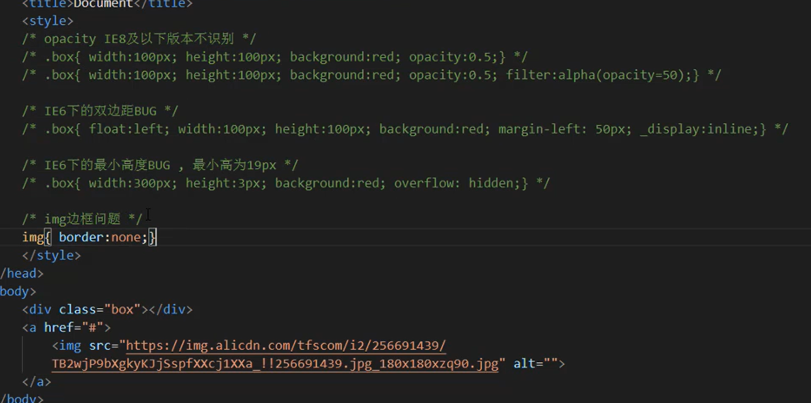

<!--
 * @Author: your name
 * @Date: 2020-06-12 00:03:00
 * @LastEditTime: 2020-07-22 01:20:02
 * @LastEditors: Please set LastEditors
 * @Description: In User Settings Edit
 * @FilePath: \home\web学习\html5学习\readme.md
-->

# hmtl:5 学习

## table

1.表格标签

2.表格属性
border :表格边框
cellpadding: 单元格内的空间
cellspacing: 单元格之间的空间
rowspan:合并行
colspan: 合并列
align: 左右对齐方法
值： left,center,right
valign:上下对齐方式
值：top,middle,bottom

## css 基本样式

1.% 是相对它的父元素的大小设置的，而不是 body 的大小

## 在 html 页面中引入外部样式

1. 通过 link

```html
<link rel="stylesheet" type="text/css" href="index.css" />
```

2. 在 style 通过 @import 但不建议使用

```html
<style>
  @import url("index.css");
</style>
```

## css 背景样式 background

- background-color: 背景颜色

* background-image:url(背景图地址) 背景图

- background-repeat ：平铺方式
  值：repeat-x x 轴平铺
  repeat-y y 轴平铺
  repeat 水平垂直方向都平铺， 这是默认值
  no-repeat 水平垂直方向都不平铺

* background-position 背景位置
  值: x y : x,y 轴位置

- background-attachment 背景图随滚动条移动的方式
  值： scroll 背景图片随着页面的滚动而滚动，这是默认的。 ,
  fixed 背景图片不会随着页面的滚动而滚动。

# font 文字样式

- text-transform ： 文字大小写转化
  值： uppercase : 文字全部大写
  lowercase: 文字全部小写
  capitalize 单词首字母大写
  none: 不转化

- font-size: 文字大小
  文字单位： px ：像素
  em: 相对 bai 单位，基准点为父节点字体的大 du 小，如果自 zhi 身定义了 font-size 按自身来计算
  rem：相对单位，可理解为”root em”, 相对根节点 html 的字体大小来计算，CSS3 新加属性

  font-indet: 文本首行缩进：
  值：px, em rem

## css 选择器

### css 层次选择器

后代： M N
父子： M > N
兄弟： M ~ N 选择 M **下面**的所有匹配的兄弟 N 元素 （M 上面的元素不起作用）
相邻： M + N 选择 M **下面**的所有匹配的相邻 N 元素 （M 上面的元素不起作用）
也就是 M 后面的第一个 N 元素

### css 属性选择器


### css 伪类选择器

M:伪类 {}
:link{} 访问前的样式 （只能添加给 a 标签）
:visited{} 访问后的样式 （只能添加给 a 标签）
:hover{} 鼠标移入的样式 （可以给所有标签添加）
:active{} 鼠标按下时的样式 （可以给所有标签添加）

如果想让这四个属性都生效的话 只能给 a 标签添加，则必须顺序为： l v h a
一般网站 a 标签都只设置 a{} a:hover{} 属性

:after , :before 通过伪类的方式给元素添加一个内容， 使用的属性为: content
例如： div:after{ content:"hello world"}
:checked , :disabled , : focus //这些是针对表单元素添加的伪类选择器

### 结构性伪类选择器

:nth-of-type(){}
：nth-child(){}
下标 n 是从 1 开始的, 其中可以使用 "n"值, 表示从 0 到无穷大

:first-of-type
:last-of-type
:only-onf-type

### css 继承

文字相关的样式是可以继承的，
布局相关的样式是不可以被继承的 (默认是不能继承的，但可以设置继承属性，inherit 值)
参考 css 继承.html

### 样式优先级

style 行间 > id > class >tag > \* > 继承
优先级权重：
style 行内 权重： 1000
id 权重： 100
class 权重： 10
tag，伪元素 权重： 1
*{}  权重： 0

### 层次优先级 比较

1. 权重比较
   ul li .box p input {} 1+1+10+1+1
   .hello span #elem {} 10+1+100
2. 约分比较
   两组比较去掉相同的选择器  
   ul li .box p input {} 剩余： li p input 1+1+1
   .hello span #elem {} 剩余： span #elem 10+100

### css 盒子模型

盒子模型拿快递来举例
content -> padding -> border -> margin
物品 填充物 包装盒 盒子与盒子之间的距离

padding
值： 只写一个：30px 上下左右
只写两个： 30px 40px ; 上下 左右
写四个：10px 20px 30px 40px； 上 右 下 左
margin 与 padding 同理

关于 css 盒子注意的：
背景色只能填充到 margin 以内的区域（不包括 margin）
文字只能出现在 content 区域内
paddign 不能为负数，margin 可以为负数

#### css 盒子的 box-sizing

box-sizing: 盒子尺寸， 可以改变盒子展示形态
值有：cotent-box: 默认的， width，height: 为 content 的宽高
border-box: width,height: 为 content，padding,content 的宽高

它的使用场景：

1. 我们不用计算盒子的 width，height 值
2. 解决盒子的宽高的 100% 问题

#### css 盒子常见的问题

1.  margin 上下间距叠加问题
    当两个盒子同时添加上下左右外边距的时候，上下外边距会出现叠加问题，左右外边距不会出现叠加问题，会取连个间距最大的那个值
    解决方法：
    1. BFC 方案
    2. 想办法只给一个盒子添加外边距

2.margin 传递问题
当 margin 传递只会出现在嵌套的结构中，只有 margin-top 这个有传递问题，其他的三个方向没有传递问题
解决方法：

1.  BFC 方案
2.  给父容器添加边框 .father{ border:1px solid black;}
3.  我们在子容器的里的 pargin-top 换成父容器里的 padding-top,并且要修改父容器的里的 height ，要减去 padding-top 的值
    .father{ padding-top: 100px; height: 100px}

#### css 盒子常用的技巧

1. margin 左右自适应居中
   可以： margin-left:auto; margin-right: auto;
   简写为： margin: 0 auto;
   注意： 这个只能左右自适应居中，不能上下居中

2. 不设置 content 现象
   当我们不设置 width，height 时，对盒子模型的影响，会自动去计算容器的大小，节省代码。

### 标签分类


影藏：
display: none; 不占空间的影藏
visibility: hidden; 占空间的影藏

### 溢出隐藏


### css 样式重置

可参考 这个连接 https://blog.csdn.net/weixin_43831615/article/details/100399374
先前端 css 步骤

1. 写 html 结构
2. 先重置 css 原本样式
3. 再根据需求开发自己的 css 风格

### ps 使用：


## float 浮动


### float 注意点


### 清除浮动


## 定位

### 相对定位


### 绝对定位


### fixed 定位


### sticky 定位（黏性定位）

在指定的位置，进行黏性操作
例如： div{position:sitcky; top:100px;}
div 会在 100px 位置进行固定不动，

### z-index 定位层级

z-index: 默认为 0 ，可以为负数
解决嵌套时候的层级问题
z-index 数大的层级越往上

#### 文字超过就...显示

4 步：
width 100px; white-space: nowrap; overflow: hidden; text-overflow: ellipsis;

### css 精灵图 sprite


### iframe 嵌套页面


### br 与 wbr


### pre 与 code


### map 与 area 标签

可以给指定的区域指定一个链接： 如给图片的某一个区域设置一个链接， area 形状可以为：矩形，圆形，多边形；
实例代码：


### embed 与 object


示例代码：

注意： 这个 embed 与 Object 需要 flash 支持，它在移动端支持非常差或不支持，逐渐被 video 替代

### audio 与 video


示例代码


### 文字注解与文字方向


实例代码：


### link 扩展


### 扩展 meta


### BFC 规范

#### 触发 bfc


#### 浏览器前缀


### trnsition 过渡


过度曲线网站： https://cubic-bezier.com/

### transfrom 变形


### ie 低版本 bug


解决方法：


### 渐进增强与优雅降级


### 等高布局

让左右两者 div 随时都 等高


### 三列布局 （左右固定，中间自适应）


双飞翼布局


### 圣杯布局


## flex 布局

display:flex;

### flex-wrap


### justify-content


### align-items


### align-content


### flex 子项 css 属性：


## grid 布局

### justify-items 和 align-items


### justify-content 和 align-content


### 作用在 grid 子项的 css 属性


## 移动端

### viewport 视口


### viewport 设置


### 流式布局原则


### rem 布局


### rem 通过 js 来设置

let fontSize = document.documentElement.clientWidth / 3.75;
document.documentElement.style.fontSize = fontSize + 'px';

### rem 可以通过 vw 来设置

使用 px to rem 插件

html{ font-size: 26.6667 vw;}
body{font-size: 16px; } 要在 body 里重置一下 font-size ，不然字体会变为 html 设置的字体大小了。

## 响应式布局

### 媒体类型


### 响应式布局-常见选项


## css 新特性

### css 新特性之 shapes

css shapes 布局可以实现不规则的文字环绕效果，需要和浮动配合使用
shape-outside: margin-box; 以外边距环绕 。。。。
shape-margin: 以外边距环绕的距离
clip-path: 裁切一个路径的
clip-path： poygon(0 0, 0 100px, 100px 100px)


### css 新特性之 scrollbar


实例


### css 新特性之 scroll Snap


实例

